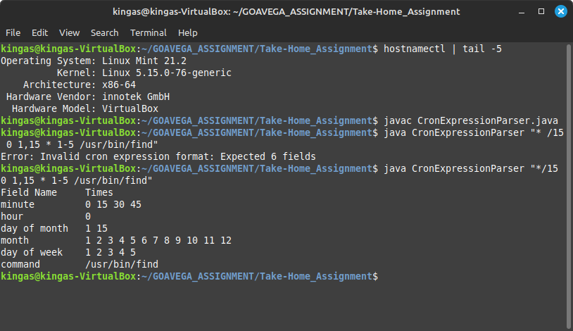
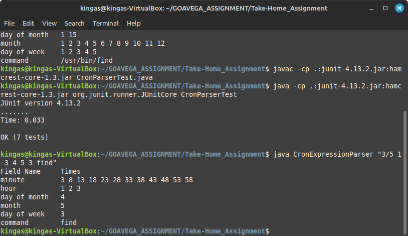
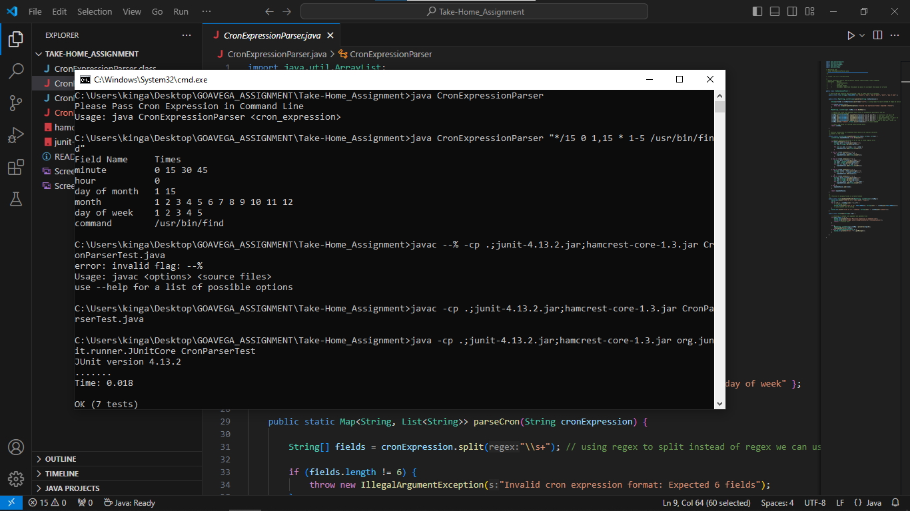
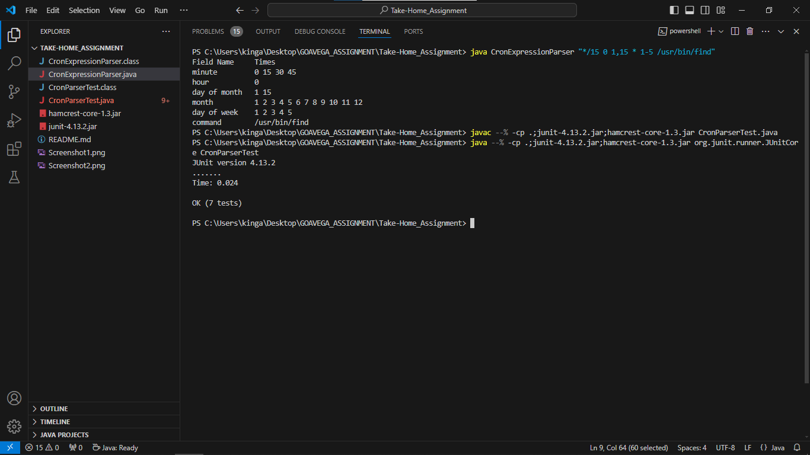

# Cron Expression Parser

### Decription

It Is a Java Program which parse a cron String and expands each field to show the times at which it will run.  

It will expand the fields Such as mintue, hour, day of month, month and day of week while interpreting the special character present in a expression.

[GitHub Link](https://github.com/KingAs6583/CronParser)

### Usage

Command-line Syntax

> CronExpressionParser <cron_Expression>

### Compilation and Execution

Used JDK Version openjdk 21.0.3 2024-04-16  
you can use other version of JDk above 11

Open CMD in Windows Or Terminal in Linux in the code placed Folder and copy paste these commands base on OS and Terminal to compile and run the program

**Compilation**
```
javac CronExpressionParser.java
```

**Execution**
```
java CronExpressionParser "*/15 0 1,15 * 1-5 /usr/bin/find"
```

**Excepted Output**

| Field Name   |   Times                    |
| -----------  | ----------                 |
| minute       |  0 15 30 45                |       
| hour         |  0                         |
| day of month |  1 15                      |
| month        |  1 2 3 4 5 6 7 8 9 10 11 12|        
| day of week  |  1 2 3 4 5                 |
| command      |  /usr/bin/find             |


### Test Cases

> There are 2 jar file name junit-4.13.2.jar and hamcrest-core-1.3.jar who are responsible for runing Test class called CronParserTest without them test class will not work and you have the place all java files and .jar file in single folder then you have to run and compile the test case

**Compilation of Test Class in <mark> Linux </mark>**
```
javac -cp .:junit-4.13.2.jar:hamcrest-core-1.3.jar CronParserTest.java 
```
**Execution of Test Class in <mark> Linux </mark>**
```
java -cp .:junit-4.13.2.jar:hamcrest-core-1.3.jar org.junit.runner.JUnitCore CronParserTest
```
<hr>

**Compliation of Test Class in <mark>Windows</mark>**
```
javac -cp .;junit-4.13.2.jar;hamcrest-core-1.3.jar CronParserTest.java
```

**Execution of Test Class in <mark>Windows</mark>**
```
java -cp .;junit-4.13.2.jar;hamcrest-core-1.3.jar org.junit.runner.JUnitCore CronParserTest
```
<hr>

**Compliation of Test Class in <mark>PowerShell or VS Code</mark>**
```
javac --% -cp .;junit-4.13.2.jar;hamcrest-core-1.3.jar CronParserTest.java
```

**Execution of Test class in <mark>PowerShell or VS Code</mark>**
```
java --% -cp .;junit-4.13.2.jar;hamcrest-core-1.3.jar org.junit.runner.JUnitCore CronParserTest
```

<hr>

**Expected Output of test cases**

```
arserTest
JUnit version 4.13.2
.......
Time: 0.039

OK (7 tests)
```

> Note: This Code is written and Test in Linux Mint Operating System(OS) along with java version 21 and junit version 4.13.2 for testing also Tested in Windows.   
To Reduce the overhead and it is commandline program thats why didn't opted a project structure and place all code in single folder

**ScreenShot in Linux**




**ScreenShot in Windows CMD**


**Screenshot in Windows Powershell**

